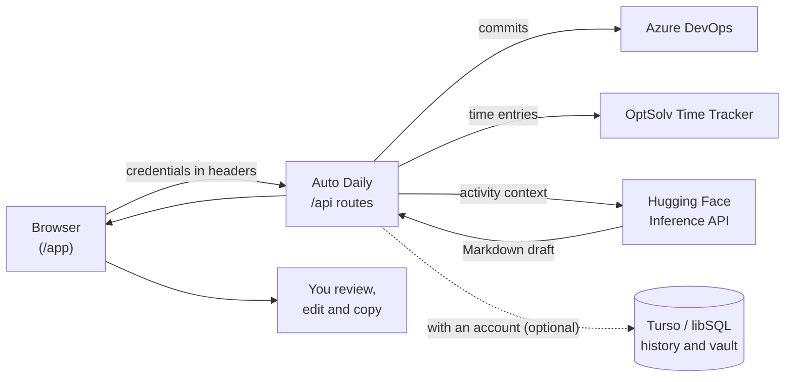

<div align="center">
  <a href="https://auto-daily-app.vercel.app">
    <picture>
      <source media="(prefers-color-scheme: dark)" srcset="public/brand/horizontal-dark.svg">
      
    </picture>
  </a>

  <h3>Your work, well told.</h3>

  <p>
    Daily standup drafts from your Azure DevOps commits and OptSolv Time Tracker hours.<br>
    AI writes the draft, you review and share it.
  </p>

  <p>
    <a href="https://auto-daily-app.vercel.app"><strong>Website</strong></a> ·
    <a href="https://auto-daily-app.vercel.app/app"><strong>Open the app</strong></a> ·
    <a href="#getting-started">Getting started</a> ·
    <a href="CHANGELOG.md">Changelog</a> ·
    <a href="https://github.com/Marcus-Boni/Auto-Daily-App/issues/new">Report an issue</a> ·
    <a href="README.md">Português</a>
  </p>

  <p>
    <a href="https://github.com/Marcus-Boni/Auto-Daily-App/actions/workflows/ci.yml"></a>
    <a href="CHANGELOG.md"></a>
    <a href="LICENSE"></a>
    <a href="https://nextjs.org"></a>
    <a href="https://react.dev"></a>
    <a href="https://www.typescriptlang.org"></a>
    <a href="https://tailwindcss.com"></a>
    <a href="https://auto-daily-app.vercel.app"></a>
    <a href="CONTRIBUTING.md"></a>
  </p>
</div>

<p align="center">
  
</p>

> The product interface is in Brazilian Portuguese. This README describes it in English; UI labels are quoted in Portuguese with a translation where it helps.

## Table of contents

- [About](#about)
- [How it works](#how-it-works)
- [Features](#features)
- [Overview](#overview)
- [Tech stack](#tech-stack)
- [Getting started](#getting-started)
- [Environment variables](#environment-variables)
- [Deployment](#deployment)
- [Data, privacy and limits](#data-privacy-and-limits)
- [Scripts](#scripts)
- [Project structure](#project-structure)
- [Design and motion](#design-and-motion)
- [Continuous integration](#continuous-integration)
- [Versioning and changelog](#versioning-and-changelog)
- [FAQ](#faq)
- [Contributing](#contributing)
- [Security](#security)
- [License](#license)

## About

At 09:12, eighteen minutes before the standup, nobody quite remembers what they did yesterday. The facts are already recorded: in the repository's commits and in the hours logged in the time tracker. Auto Daily queries those sources, hands the context to a language model and returns a structured draft for you to review.

Three principles shape the project:

- **Nothing is made up.** The prompt forbids goals, results, next steps and blockers that are not in the records. Gaps come back as `Não informado nos dados consultados; revisar antes de compartilhar.` ("Not found in the queried data; review before sharing") and are highlighted in the document.
- **You have the final word.** The draft is editable as Markdown, and a new draft never replaces your edits without asking. Sharing is always manual.
- **Sources in plain sight.** Every draft lists the commits and time entries it came from.

## How it works



1. Connect one or both sources in the **Integrações** (Integrations) area and test the connection.
2. Pick a window (from 24 hours to 30 days) and a report format.
3. The app's routes query the sources and send the context to the model configured on Hugging Face.
4. The draft comes back with the evidence it used; you review, adjust and copy it.

## Features

**Generation**
- Independent or combined sources: **Azure DevOps** commits (with an optional author filter) and **OptSolv Time Tracker** entries (with an optional email filter).
- Six rolling windows: 24, 48 and 72 hours; 7, 14 and 30 days.
- Two formats: **Daily Scrum** (done, next steps and blockers) and **Executive summary**.
- Extra instructions to steer the text, up to 4,000 characters.

**Review**
- Markdown editor, one-click copy and the list of records behind each draft.
- The draft survives navigation, cancellation and failure recovery.
- An explicit choice between using a new draft or keeping your edits.
- Connection testing is separate from saving: editing any field invalidates the previous test.

**Optional account**
- Sign in with email and password, or with GitHub when OAuth is configured ([Better Auth](https://www.better-auth.com)).
- Automatic history of generated dailies, with search, copy and delete.
- Server-side credential vault encrypted with AES-256-GCM, with sync and restore actions.

**Experience**
- Public homepage with an interactive demo (synthetic data); the app lives at `/app`.
- Light and dark themes, responsive layout and a collapsible sidebar (`Ctrl+B`).
- Smooth scrolling and choreographed motion, with a complete alternative for reduced-motion users.
- The current version and release notes are one click away in the sidebar footer.

## Overview

<table>
  <tr>
    <td width="50%">
      <picture>
        <source media="(prefers-color-scheme: dark)" srcset="docs/media/home-dark.webp">
        
      </picture>
      <p align="center"><sub>Homepage</sub></p>
    </td>
    <td width="50%">
      <picture>
        <source media="(prefers-color-scheme: dark)" srcset="docs/media/app-dark.webp">
        
      </picture>
      <p align="center"><sub>App (synthetic data)</sub></p>
    </td>
  </tr>
</table>

## Tech stack

| Layer | Technologies |
| --- | --- |
| Framework | [Next.js 16](https://nextjs.org) (App Router, Turbopack), [React 19](https://react.dev), TypeScript 5 |
| UI | [Tailwind CSS 4](https://tailwindcss.com), [Radix UI](https://www.radix-ui.com) with shadcn/ui-style components, Lucide, Sonner |
| Motion | [Lenis](https://lenis.darkroom.engineering), [GSAP](https://gsap.com) (ScrollTrigger, SplitText), [Motion](https://motion.dev) |
| State and validation | Zustand, Zod |
| AI | [Hugging Face Inference API](https://huggingface.co/docs/inference-providers) (chat completions) |
| Authentication | [Better Auth](https://www.better-auth.com) |
| Database | [Drizzle ORM](https://orm.drizzle.team) with [libSQL / Turso](https://turso.tech) |
| Quality | [Biome](https://biomejs.dev), `node:test` |

## Getting started

### Prerequisites

- Node.js **20.9** or later and npm.
- A Hugging Face access token ([create one](https://huggingface.co/settings/tokens)).
- To use the app: read access to Azure DevOps (a PAT with the **Code: Read** scope) and/or an OptSolv Time Tracker integration key.

### Installation

```bash
git clone https://github.com/Marcus-Boni/Auto-Daily-App.git
cd Auto-Daily-App
npm ci
cp .env.example .env
```

In PowerShell, use `Copy-Item .env.example .env` instead of `cp`.

Edit `.env` and set at least `HUGGINGFACE_API_KEY`. For accounts, history and the vault, also set `BETTER_AUTH_SECRET` and `ENCRYPTION_SECRET` and create the tables:

```bash
npx drizzle-kit migrate
```

Without `TURSO_DATABASE_URL`, the database is a local SQLite file (`local.db`). Using the app without an account does not depend on the tables.

Start the dev server:

```bash
npm run dev
```

Open [http://localhost:3000](http://localhost:3000) for the homepage and [http://localhost:3000/app](http://localhost:3000/app) for the app.

### Configure a source

In the app's **Integrações** area:

- **Azure DevOps:** organization, project, repository name or ID and a PAT with **Code: Read** permission. The author filter accepts a name or an email.
- **OptSolv Time Tracker:** a read-only integration key or M2M token. The optional email limits the entries to that person.

**Salvar** (Save) applies the data to the app; **Testar conexão** (Test connection) queries the source with a reduced limit. An empty response proves access, not that activity exists.

## Environment variables

| Variable | Required | Description |
| --- | --- | --- |
| `HUGGINGFACE_API_KEY` | Yes | Hugging Face token used on the server to generate drafts. |
| `HUGGINGFACE_MODEL` | No | Chat model. Default: `Qwen/Qwen2.5-Coder-7B-Instruct`, falling back to `meta-llama/Llama-3.1-8B-Instruct` if the model is not supported. |
| `TURSO_DATABASE_URL` | No | libSQL database URL. Default: `file:local.db`. In production, use `libsql://your-db.turso.io`. |
| `TURSO_AUTH_TOKEN` | With remote Turso | Turso database token. Leave empty for the local file. |
| `BETTER_AUTH_SECRET` | For accounts | Random secret of at least 32 bytes used by Better Auth. |
| `BETTER_AUTH_URL` | For accounts | Public URL of the app. Default: `http://localhost:3000`. |
| `ENCRYPTION_SECRET` | For the vault | AES-256-GCM vault key: 64 hexadecimal characters (32 bytes). Other values are derived with SHA-256. |
| `GITHUB_CLIENT_ID` | No | Enables GitHub sign-in together with `GITHUB_CLIENT_SECRET`. |
| `GITHUB_CLIENT_SECRET` | No | GitHub OAuth App secret. |
| `SITE_URL` | In production | Public URL used for canonical and Open Graph metadata. Set it before building. |

<details>
<summary>Generating the secrets</summary>

```bash
# BETTER_AUTH_SECRET
node -e "console.log(require('crypto').randomBytes(32).toString('base64'))"

# ENCRYPTION_SECRET (64 hexadecimal characters)
node -e "console.log(require('crypto').randomBytes(32).toString('hex'))"
```

For GitHub sign-in, create an OAuth App with the callback URL `<BETTER_AUTH_URL>/api/auth/callback/github`.

</details>

## Deployment

The official instance runs on Vercel: [auto-daily-app.vercel.app](https://auto-daily-app.vercel.app).

[](https://vercel.com/new/clone?repository-url=https%3A%2F%2Fgithub.com%2FMarcus-Boni%2FAuto-Daily-App&env=HUGGINGFACE_API_KEY,TURSO_DATABASE_URL,TURSO_AUTH_TOKEN,BETTER_AUTH_SECRET,BETTER_AUTH_URL,ENCRYPTION_SECRET,SITE_URL&envDescription=See%20the%20environment%20variables%20table%20in%20the%20README&envLink=https%3A%2F%2Fgithub.com%2FMarcus-Boni%2FAuto-Daily-App%2Fblob%2Fmain%2FREADME.en.md%23environment-variables&project-name=auto-daily&repository-name=auto-daily)

1. Create a database on [Turso](https://turso.tech). The `local.db` file does not persist on serverless platforms.
2. Set the variables above in your Vercel project, with `BETTER_AUTH_URL` and `SITE_URL` pointing to your domain.
3. Apply the migrations to the remote database from your machine:

   ```bash
   TURSO_DATABASE_URL="libsql://your-db.turso.io" TURSO_AUTH_TOKEN="your-token" npx drizzle-kit migrate
   ```

The generation route declares `maxDuration = 60` seconds. For hosting outside Vercel, the build uses `output: "standalone"`; the legacy Azure setup lives in [docs/AZURE_DEPLOY.md](docs/AZURE_DEPLOY.md).

## Data, privacy and limits

**Credentials**
- By default, PATs and tokens live only in page memory: reloading or closing the page discards them.
- **Lembrar credenciais neste dispositivo** (Remember credentials on this device) is opt-in and uses the browser's local storage, unencrypted.
- With an account, you can sync credentials to the server vault, encrypted with AES-256-GCM.
- Credentials travel through the app's routes, in headers, only to query the sources. The Hugging Face key stays on the server.
- Settings from older versions are migrated without the tokens that used to be stored without consent; enter them again.

**Content**
- The activity context and your extra instructions are sent to the AI provider. Check your organization's data policies and the provider's terms before using operational data.
- Without an account, drafts are not stored. With an account, every generated draft is added to your history, and you can delete it at any time.

**Known limits**
- Azure DevOps provides commits, not work items. The query uses the 100 most recent commits in the window.
- OptSolv returns the first page, with up to 200 entries, and accepts UTC calendar dates; precision differs from a timestamp window.
- AI can miss context or misread a record. Commits do not prove a release and logged hours do not measure productivity.

## Scripts

| Command | What it does |
| --- | --- |
| `npm run dev` | Development server |
| `npm run build` | Production build |
| `npm run start` | Local production server (`next start`) |
| `npm run check` | Biome lint and format, applying fixes |
| `npm run check:ci` | Lint and format without changing files (CI and pre-commit) |
| `npm run lint` | Biome lint without changing files |
| `npm run type-check` | TypeScript type check |
| `npm test` | `node:test` suite, no external services |
| `npm run brand:build` | Regenerates brand assets from `src/lib/brand.json` |
| `npm run release` | Cuts a release (see [Versioning and changelog](#versioning-and-changelog)) |
| `npx drizzle-kit migrate` | Applies database migrations |

## Project structure

```text
src/
├── app/
│   ├── page.tsx              homepage (/)
│   ├── app/page.tsx          app (/app)
│   ├── api/                  routes: generate, azure, optsolv, auth, dailies, user/integrations
│   ├── layout.tsx            metadata, theme and smooth scrolling
│   └── globals.css           design system tokens
├── components/
│   ├── home/                 homepage sections and demo
│   ├── daily/                preparation, document and sources
│   ├── integrations/         integration forms
│   ├── auth/                 sign-in and account menu
│   ├── motion/               Lenis, entrances and micro-interactions
│   └── ui/                   Radix / shadcn primitives
├── hooks/                    generation and user configuration
├── lib/                      services (AI, Azure, OptSolv), database, auth, vault and prompts
└── types/                    contracts
drizzle/                      SQL migrations
.github/workflows/            CI and legacy Azure deployment
.husky/                       commit hooks
tests/                        regression tests
docs/                         brand, redesign, media and deployment
```

## Design and motion

The visual system is documented in [DESIGN.md](DESIGN.md) (Portuguese), and the identity (the "Daily aberto" mark and the Geist signature) in [docs/brand](docs/brand/README.md).

Lenis smooth scrolling runs on the GSAP ticker, which choreographs the homepage's scroll-pinned sequences. Motion handles interface state: area switches, the navigation indicator, document notices and scroll entrances. With `prefers-reduced-motion`, the homepage uses a stacked layout without pinned scrolling, and content never depends on JavaScript to appear.

## Continuous integration

[](https://github.com/Marcus-Boni/Auto-Daily-App/actions/workflows/ci.yml)

The **CI Quality Gate** workflow ([.github/workflows/ci.yml](.github/workflows/ci.yml)) runs on every push and pull request to `main`, on Node.js 20:

1. `npm ci`
2. `npm run check:ci` (Biome in check mode: fails instead of fixing)
3. `npm run type-check`
4. `npm test`
5. `npm run build`, with placeholder variables so the build does not depend on real services

New runs on the same branch cancel older ones. The `azure-appservice.yml` workflow keeps the legacy Azure deployment pipeline, described in [docs/AZURE_DEPLOY.md](docs/AZURE_DEPLOY.md).

### Commit hooks

[Husky](https://typicode.github.io/husky) is installed by `npm ci` (the `prepare` script) and runs two local hooks:

| Hook | What it does |
| --- | --- |
| `pre-commit` | `npm run check:ci`, `npm run type-check` and `npm test`. If Biome flags something, run `npm run check` to fix it |
| `commit-msg` | Validates the message with [commitlint](https://commitlint.js.org) against [Conventional Commits](https://www.conventionalcommits.org) |

Allowed types: `feat`, `fix`, `docs`, `style`, `refactor`, `perf`, `test`, `build`, `ci`, `chore` and `revert`. Example: `feat(daily): add weekly summary format`.

## Versioning and changelog

[](CHANGELOG.md)

The project follows [Semantic Versioning](https://semver.org). Each version's changes are listed in [CHANGELOG.md](CHANGELOG.md) (Portuguese), generated from Conventional Commits, and published versions live under [Releases](https://github.com/Marcus-Boni/Auto-Daily-App/releases).

### Cutting a release

For maintainers, with [release-it](https://github.com/release-it/release-it):

| Command | When to use it |
| --- | --- |
| `npm run release` | Interactive: suggests the next version from the commits |
| `npm run release:patch` | Backward-compatible fixes (`1.0.0` to `1.0.1`) |
| `npm run release:minor` | Backward-compatible features (`1.0.0` to `1.1.0`) |
| `npm run release:major` | Breaking changes (`1.0.0` to `2.0.0`) |
| `npm run release:ci` | Non-interactive release, for automation |

Each release:

1. bumps the version in `package.json`;
2. writes the new `CHANGELOG.md` section from the commits since the last tag (`feat`, `fix`, `perf` and `revert`, with Portuguese section titles);
3. creates the `chore(release): vX.Y.Z` commit and the annotated `vX.Y.Z` tag;
4. publishes the `vX.Y.Z` GitHub Release (nothing is published to npm).

Requirements: a clean working directory, at least one commit since the last tag and a `GITHUB_TOKEN` variable allowed to create releases in the repository.

In the app, the current version shows in the sidebar footer and opens the release notes panel. The version comes from `package.json` at build time, and the panel shows the newest `CHANGELOG.md` section: after a release, the next deploy shows the new notes with no manual edits.

## FAQ

<details>
<summary><strong>Do I need both Azure DevOps and OptSolv?</strong></summary>

No. Use one source or combine both.

</details>

<details>
<summary><strong>Does Auto Daily read Azure DevOps work items?</strong></summary>

No. The integration uses repository commits.

</details>

<details>
<summary><strong>Can I use a different AI model?</strong></summary>

Yes, any chat model available on the Hugging Face Inference API, set in `HUGGINGFACE_MODEL`.

</details>

<details>
<summary><strong>Do I need a database?</strong></summary>

Only for accounts, history and the vault. Locally, a SQLite file is created automatically; on serverless platforms, use Turso.

</details>

<details>
<summary><strong>Is the interface available in English?</strong></summary>

Not yet. The interface and the generated drafts are in Brazilian Portuguese.

</details>

## Contributing

Contributions are welcome. Before you start, read the [contributing guide](CONTRIBUTING.md) and the workspace instructions in [AGENTS.md](AGENTS.md).

1. Fork the repository and create a branch from `main`.
2. Write Conventional Commits messages; the commit hooks validate the message and run lint, types and tests.
3. Run `npm run build` before opening a PR. CI repeats every check.
4. Use synthetic data in tests, screenshots and docs; never include tokens or private activity.

To exercise the UI with synthetic responses, use the server described in [docs/redesign/IMPLEMENTATION-VALIDATION.md](docs/redesign/IMPLEMENTATION-VALIDATION.md) (Portuguese). It is a development tool and not part of the published product.

Found a bug or have an idea? [Open an issue](https://github.com/Marcus-Boni/Auto-Daily-App/issues/new).

## Security

Do not post credentials or vulnerability details in public issues. See [SECURITY.md](SECURITY.md) for how to report.

Before publishing a fork, review the Git history for secrets: a development key removed from the code still exists in older commits. If it grants real access, revoke it with the issuing service.

## License

Distributed under the [MIT](LICENSE) license. The brand signature uses Geist under the [SIL Open Font License](public/brand/OFL-Geist.txt), and Lucide icons keep their notices in [public/lucide-LICENSE.txt](public/lucide-LICENSE.txt).

Created by [Marcus Boni](https://github.com/Marcus-Boni).
