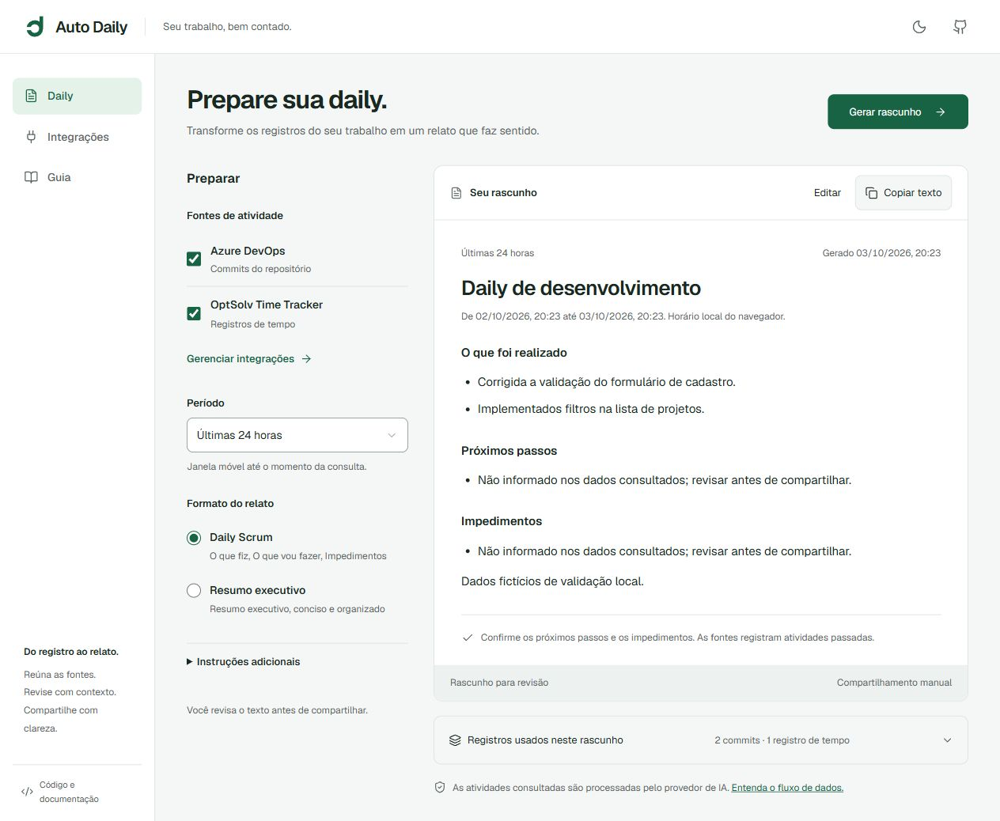

# Auto Daily

<picture>
  <source media="(prefers-color-scheme: dark)" srcset="public/brand/horizontal-dark.svg">
  
</picture>

Seu trabalho, bem contado.

> 🌐 **Aplicação oficial no ar:** [Auto Daily | Seu trabalho, bem contado.](https://auto-daily-app.vercel.app/)

Prepare um rascunho de daily a partir de commits do Azure DevOps e registros do OptSolv Time Tracker. Revise o texto, confira as fontes e copie quando ele representar o que você quer compartilhar.



## O que o aplicativo faz

- **Geração Inteligente**: commits do Azure DevOps e horas do OptSolv estruturados por IA via Hugging Face (`Qwen2.5-Coder-7B`).
- **Autenticação Moderna**: login com 1 clique via GitHub OAuth ou Email/Senha via Better Auth.
- **Banco de Dados Serverless**: histórico persistente e pesquisável no Turso (libSQL) com Drizzle ORM.
- **Cofre Criptografado (AES-256-GCM)**: PATs e tokens encriptados no servidor com chave militar de 256 bits antes do armazenamento.
- **Seleção Independente**: seis períodos móveis (de 24 horas a 30 dias) e formatos Daily Scrum ou Executivo.
- **Editor Markdown e Evidências**: rascunho preservado ao navegar, cancelar ou recuperar falhas.
- **Temas e Acessibilidade**: temas claro/escuro, barra lateral retrátil com atalhos de teclado (`Ctrl+B`) e design responsivo.

Azure fornece commits, não work items. A consulta atual limita Azure aos 100 commits mais recentes e OptSolv à primeira página de até 200 registros. OptSolv aceita datas de calendário UTC; sua precisão difere de uma janela de timestamps. Essas limitações aparecem junto às fontes do resultado.

## Executar localmente

Requer Node.js **20.9 ou superior** e npm. Não é necessário adicionar banco de dados.

```powershell
git clone https://github.com/Marcus-Boni/Auto-Daily-App.git
cd Auto-Daily-App
npm ci
Copy-Item .env.example .env
```

Configure `HUGGINGFACE_API_KEY` no arquivo `.env` com uma chave do seu provedor e inicie:

```powershell
npm run dev
```

Na hospedagem pública, configure também `SITE_URL` com a URL real do aplicativo **antes do build**. Ela determina canonical e os URLs de compartilhamento Open Graph/Twitter. Sem essa configuração, os metadados de desenvolvimento usam `http://localhost:3000` e não declaram canonical.

Abra a URL exibida pelo servidor. A página inicial fica em `/` e o aplicativo em `/app`. A chave do provedor fica no servidor; PAT e token das fontes são configurados na área **Integrações**.

### Configurar uma fonte

**Azure DevOps:** organização, projeto, nome/ID do repositório e PAT com permissão **Code · Read**. O filtro opcional aceita nome ou e-mail do autor.

**OptSolv Time Tracker:** chave de integração ou token de leitura. O e-mail opcional restringe os registros consultados aos do colaborador.

Salvar aplica os dados ao aplicativo. Testar conexão consulta a fonte com um limite reduzido e verifica acesso naquele momento. Editar qualquer campo invalida o teste anterior. Uma resposta vazia pode comprovar acesso, mas não comprova existência de atividades.

Depois, volte à Daily, selecione fontes, período e formato e gere o rascunho. As opções atuais não reescrevem os metadados de um documento já gerado.

## Dados e credenciais

Por padrão, tokens ficam apenas na memória da página. Recarregar ou fechar a página os descarta. **Lembrar credenciais neste dispositivo** é opt-in: usa armazenamento local sem criptografia. Preferências e identificação das integrações são lembradas quando o navegador permite armazenamento.

Este redesign migra configurações antigas descartando os tokens que eram persistidos sem escolha explícita. Organização, projeto, repositório e filtros são preservados. Informe novamente as credenciais se estiver atualizando uma instalação anterior.

As credenciais passam pelas APIs da aplicação para consultar as fontes. O contexto das atividades e as instruções adicionais são enviados ao provedor de IA. Os rascunhos não são persistidos e o compartilhamento é manual. Observe as políticas de dados da sua organização e as condições do provedor.

IA pode omitir contexto ou interpretar um registro incorretamente. Commits não comprovam publicação/homologação; registros de tempo não medem produtividade. Próximos passos e impedimentos sem evidência ficam explicitamente pendentes de revisão.

## Qualidade

```powershell
npm run check
npm run type-check
npm test
npm run build
```

Os assets da identidade podem ser regenerados com `npm run brand:build`; o símbolo e os textos vêm de `src/lib/brand.json`. A imagem de compartilhamento é gerada em 1200 × 630 e utiliza a mesma identidade.

`check` aplica formatação com Biome. Os testes nativos cobrem migração, retenção, falhas parciais, contratos, cancelamento, metadados e preservação de edições. Não exigem conexão com serviços reais.

Para validar a interface com respostas fictícias, use o servidor descrito em [evidências da implementação](docs/redesign/IMPLEMENTATION-VALIDATION.md). Ele é uma ferramenta de desenvolvimento e não faz parte do produto publicado.

## Organização

```text
src/app/                      páginas, layout e APIs
src/components/home/          página inicial e demonstração com dados fictícios
src/components/motion/        rolagem suave (Lenis) e entradas compartilhadas (Motion)
src/components/daily/         preparação, documento e fontes
src/components/integrations/  formulários de integração
src/components/ui/            primitivas compartilhadas
src/hooks/                    geração e configuração do usuário
src/lib/                      serviços, regras de estado e prompts
src/types/                    contratos
tests/                        regressões sem dependências adicionais
docs/redesign/                proposta, implementação e evidências
```

O [sistema visual](DESIGN.md) documenta a implementação atual. A página inicial ocupa `/` e o aplicativo, `/app`; links antigos como `/#history` seguem para `/app#history`.

### Movimento

Lenis cuida da rolagem suave em todo o projeto e roda no ticker do GSAP, que coreografa as sequências presas à rolagem da página inicial (ScrollTrigger, SplitText). Motion (`motion/react`) cuida de estados da interface: troca de áreas, indicador da navegação, avisos do documento e entradas ao rolar. Com movimento reduzido, a página inicial usa um layout empilhado sem rolagem presa e o Lenis acompanha o dispositivo sem suavização.

## Contribuir e publicar

Leia [CONTRIBUTING.md](CONTRIBUTING.md), [SECURITY.md](SECURITY.md) e as instruções do workspace em [AGENTS.md](AGENTS.md). O aplicativo está hospedado oficialmente na Vercel em [Auto Daily | Seu trabalho, bem contado.](https://auto-daily-app.vercel.app/). A configuração legada de hospedagem no Azure está em [docs/AZURE_DEPLOY.md](docs/AZURE_DEPLOY.md).

Antes de publicar um fork/histórico, revise segredos: uma chave de desenvolvimento removida do código ainda existe no histórico anterior. Sua validade não foi verificada. Se representar acesso real, revogue/rotacione pelo serviço responsável e trate o histórico antes da publicação.

Licença [MIT](LICENSE). A [identidade visual](docs/brand/README.md) usa símbolo próprio e assinatura Geist sob [SIL OFL](public/brand/OFL-Geist.txt). Os ícones funcionais Lucide mantêm os avisos em [public/lucide-LICENSE.txt](public/lucide-LICENSE.txt). Criado por [Marcus Boni](https://github.com/Marcus-Boni).
