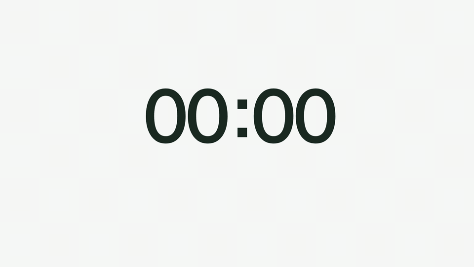
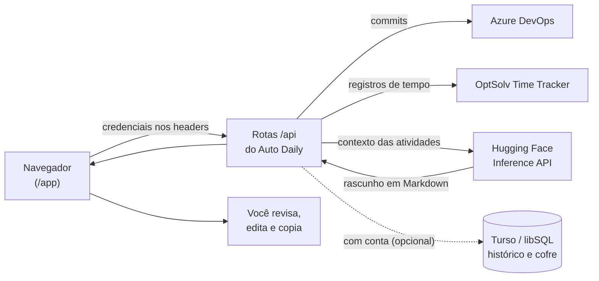
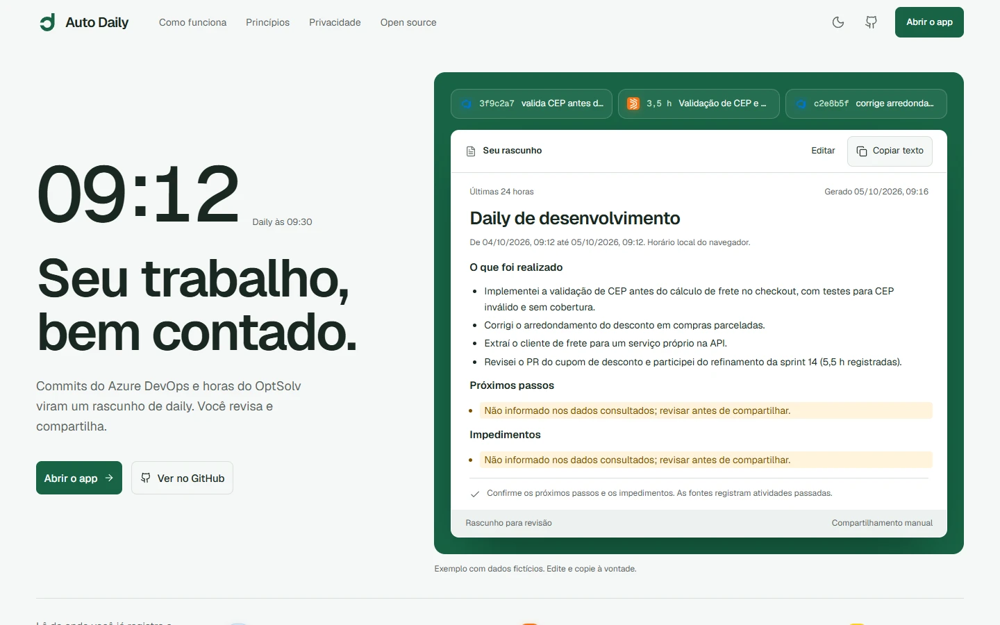
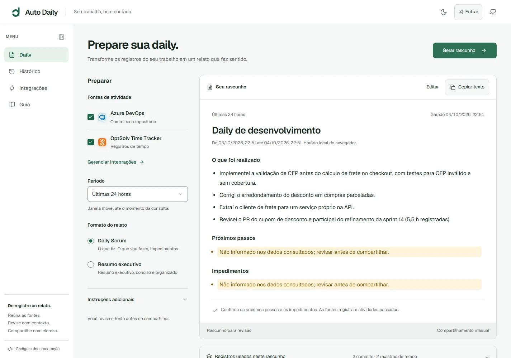

<div align="center">
  <a href="https://auto-daily-app.vercel.app">
    <picture>
      <source media="(prefers-color-scheme: dark)" srcset="public/brand/horizontal-dark.svg">
      
    </picture>
  </a>

  <h3>Seu trabalho, bem contado.</h3>

  <p>
    Rascunhos de daily a partir dos seus commits do Azure DevOps e das horas do OptSolv Time Tracker.<br>
    A IA prepara, você revisa e compartilha.
  </p>

  <p>
    <a href="https://auto-daily-app.vercel.app"><strong>Site</strong></a> ·
    <a href="https://auto-daily-app.vercel.app/app"><strong>Abrir o app</strong></a> ·
    <a href="#começando">Começando</a> ·
    <a href="https://github.com/Marcus-Boni/Auto-Daily-App/issues/new">Reportar um problema</a> ·
    <a href="README.en.md">English</a>
  </p>

  <p>
    <a href="LICENSE"></a>
    <a href="https://nextjs.org"></a>
    <a href="https://react.dev"></a>
    <a href="https://www.typescriptlang.org"></a>
    <a href="https://tailwindcss.com"></a>
    <a href="https://auto-daily-app.vercel.app"></a>
    <a href="CONTRIBUTING.md"></a>
  </p>
</div>

<p align="center">
  
</p>

## Sumário

- [Sobre o projeto](#sobre-o-projeto)
- [Como funciona](#como-funciona)
- [Funcionalidades](#funcionalidades)
- [Visão geral](#visão-geral)
- [Stack](#stack)
- [Começando](#começando)
- [Variáveis de ambiente](#variáveis-de-ambiente)
- [Deploy](#deploy)
- [Dados, privacidade e limites](#dados-privacidade-e-limites)
- [Scripts](#scripts)
- [Estrutura do projeto](#estrutura-do-projeto)
- [Design e movimento](#design-e-movimento)
- [Perguntas frequentes](#perguntas-frequentes)
- [Contribuindo](#contribuindo)
- [Segurança](#segurança)
- [Licença](#licença)

## Sobre o projeto

Às 09:12, faltando dezoito minutos para a daily, ninguém lembra direito o que fez ontem. Os fatos já estão registrados: nos commits do repositório e nas horas lançadas no time tracker. O Auto Daily consulta essas fontes, entrega o contexto a um modelo de linguagem e devolve um rascunho estruturado para você revisar.

Três princípios guiam o projeto:

- **Nada é inventado.** O prompt proíbe metas, resultados, próximos passos e impedimentos que não estejam nos registros. Lacunas chegam marcadas como `Não informado nos dados consultados; revisar antes de compartilhar.` e aparecem destacadas no documento.
- **A palavra final é sua.** O texto é editável em Markdown, e um rascunho novo nunca substitui suas edições sem perguntar. O compartilhamento é sempre manual.
- **Fontes à vista.** Cada rascunho mostra os commits e registros de tempo que o originaram.

## Como funciona



1. Você conecta uma ou duas fontes na área **Integrações** e testa a conexão.
2. Escolhe o período (de 24 horas a 30 dias) e o formato do relato.
3. As rotas da aplicação consultam as fontes e enviam o contexto ao modelo configurado na Hugging Face.
4. O rascunho volta com as evidências usadas; você revisa, ajusta e copia.

## Funcionalidades

**Geração**
- Fontes independentes ou combinadas: commits do **Azure DevOps** (com filtro opcional por autor) e registros do **OptSolv Time Tracker** (com filtro opcional por e-mail).
- Seis janelas móveis: 24, 48 e 72 horas; 7, 14 e 30 dias.
- Dois formatos: **Daily Scrum** (o que foi realizado, próximos passos e impedimentos) e **Resumo executivo**.
- Instruções adicionais para orientar o texto, com até 4.000 caracteres.

**Revisão**
- Editor Markdown, cópia em um clique e lista dos registros usados em cada rascunho.
- Rascunho preservado ao navegar, cancelar ou recuperar uma falha.
- Escolha explícita entre usar o novo rascunho ou manter suas edições.
- Teste de conexão separado do salvamento: editar qualquer campo invalida o teste anterior.

**Conta opcional**
- Login com e-mail e senha, ou com GitHub quando o OAuth estiver configurado ([Better Auth](https://www.better-auth.com)).
- Histórico automático das dailies geradas, com busca, cópia e exclusão.
- Cofre de credenciais criptografado com AES-256-GCM no servidor, com ações de sincronizar e restaurar.

**Experiência**
- Página inicial pública com uma demonstração interativa (dados fictícios); o aplicativo fica em `/app`.
- Temas claro e escuro, layout responsivo e barra lateral retrátil (`Ctrl+B`).
- Rolagem suave e movimento coreografado, com alternativa completa para quem prefere movimento reduzido.

## Visão geral

<table>
  <tr>
    <td width="50%">
      <picture>
        <source media="(prefers-color-scheme: dark)" srcset="docs/media/home-dark.webp">
        
      </picture>
      <p align="center"><sub>Página inicial</sub></p>
    </td>
    <td width="50%">
      <picture>
        <source media="(prefers-color-scheme: dark)" srcset="docs/media/app-dark.webp">
        
      </picture>
      <p align="center"><sub>Aplicativo (dados fictícios)</sub></p>
    </td>
  </tr>
</table>

## Stack

| Camada | Tecnologias |
| --- | --- |
| Framework | [Next.js 16](https://nextjs.org) (App Router, Turbopack), [React 19](https://react.dev), TypeScript 5 |
| Interface | [Tailwind CSS 4](https://tailwindcss.com), [Radix UI](https://www.radix-ui.com) com componentes no padrão shadcn/ui, Lucide, Sonner |
| Movimento | [Lenis](https://lenis.darkroom.engineering), [GSAP](https://gsap.com) (ScrollTrigger, SplitText), [Motion](https://motion.dev) |
| Estado e validação | Zustand, Zod |
| IA | [Hugging Face Inference API](https://huggingface.co/docs/inference-providers) (chat completions) |
| Autenticação | [Better Auth](https://www.better-auth.com) |
| Banco de dados | [Drizzle ORM](https://orm.drizzle.team) com [libSQL / Turso](https://turso.tech) |
| Qualidade | [Biome](https://biomejs.dev), `node:test` |

## Começando

### Pré-requisitos

- Node.js **20.9** ou superior e npm.
- Um token de acesso da Hugging Face ([criar token](https://huggingface.co/settings/tokens)).
- Para usar o app: acesso de leitura ao Azure DevOps (PAT com escopo **Code: Read**) e/ou uma chave de integração do OptSolv Time Tracker.

### Instalação

```bash
git clone https://github.com/Marcus-Boni/Auto-Daily-App.git
cd Auto-Daily-App
npm ci
cp .env.example .env
```

No PowerShell, use `Copy-Item .env.example .env` no lugar de `cp`.

Edite o `.env` e defina pelo menos `HUGGINGFACE_API_KEY`. Para contas, histórico e cofre, defina também `BETTER_AUTH_SECRET` e `ENCRYPTION_SECRET` e crie as tabelas:

```bash
npx drizzle-kit migrate
```

Sem `TURSO_DATABASE_URL`, o banco é um arquivo SQLite local (`local.db`). O uso sem conta não depende das tabelas.

Inicie o servidor:

```bash
npm run dev
```

Abra [http://localhost:3000](http://localhost:3000) para a página inicial e [http://localhost:3000/app](http://localhost:3000/app) para o aplicativo.

### Configurar uma fonte

Na área **Integrações** do app:

- **Azure DevOps:** organização, projeto, nome ou ID do repositório e um PAT com permissão **Code: Read**. O filtro de autor aceita nome ou e-mail.
- **OptSolv Time Tracker:** chave de integração ou token M2M de leitura. O e-mail opcional restringe os registros aos do colaborador.

**Salvar** aplica os dados ao app; **Testar conexão** consulta a fonte com um limite reduzido. Uma resposta vazia comprova acesso, não a existência de atividades.

## Variáveis de ambiente

| Variável | Obrigatória | Descrição |
| --- | --- | --- |
| `HUGGINGFACE_API_KEY` | Sim | Token da Hugging Face usado no servidor para gerar o rascunho. |
| `HUGGINGFACE_MODEL` | Não | Modelo de chat. Padrão: `Qwen/Qwen2.5-Coder-7B-Instruct`, com `meta-llama/Llama-3.1-8B-Instruct` como alternativa se o modelo não for suportado. |
| `TURSO_DATABASE_URL` | Não | URL do banco libSQL. Padrão: `file:local.db`. Em produção, use `libsql://seu-banco.turso.io`. |
| `TURSO_AUTH_TOKEN` | Com Turso remoto | Token do banco Turso. Deixe vazio para o arquivo local. |
| `BETTER_AUTH_SECRET` | Para contas | Segredo aleatório de pelo menos 32 bytes usado pelo Better Auth. |
| `BETTER_AUTH_URL` | Para contas | URL pública da aplicação. Padrão: `http://localhost:3000`. |
| `ENCRYPTION_SECRET` | Para o cofre | Chave do cofre AES-256-GCM: 64 caracteres hexadecimais (32 bytes). Outros valores são derivados com SHA-256. |
| `GITHUB_CLIENT_ID` | Não | Habilita o login com GitHub junto com `GITHUB_CLIENT_SECRET`. |
| `GITHUB_CLIENT_SECRET` | Não | Segredo do OAuth App do GitHub. |
| `SITE_URL` | Em produção | URL pública usada em canonical e Open Graph. Defina antes do build. |

<details>
<summary>Como gerar os segredos</summary>

```bash
# BETTER_AUTH_SECRET
node -e "console.log(require('crypto').randomBytes(32).toString('base64'))"

# ENCRYPTION_SECRET (64 caracteres hexadecimais)
node -e "console.log(require('crypto').randomBytes(32).toString('hex'))"
```

Para o login com GitHub, crie um OAuth App com a URL de callback `<BETTER_AUTH_URL>/api/auth/callback/github`.

</details>

## Deploy

A instância oficial roda na Vercel: [auto-daily-app.vercel.app](https://auto-daily-app.vercel.app).

[](https://vercel.com/new/clone?repository-url=https%3A%2F%2Fgithub.com%2FMarcus-Boni%2FAuto-Daily-App&env=HUGGINGFACE_API_KEY,TURSO_DATABASE_URL,TURSO_AUTH_TOKEN,BETTER_AUTH_SECRET,BETTER_AUTH_URL,ENCRYPTION_SECRET,SITE_URL&envDescription=Veja%20a%20tabela%20de%20vari%C3%A1veis%20no%20README&envLink=https%3A%2F%2Fgithub.com%2FMarcus-Boni%2FAuto-Daily-App%23vari%C3%A1veis-de-ambiente&project-name=auto-daily&repository-name=auto-daily)

1. Crie um banco no [Turso](https://turso.tech). Em ambientes serverless, o arquivo `local.db` não persiste.
2. Configure as variáveis acima no projeto da Vercel, com `BETTER_AUTH_URL` e `SITE_URL` apontando para o seu domínio.
3. Aplique as migrações no banco remoto a partir da sua máquina:

   ```bash
   TURSO_DATABASE_URL="libsql://seu-banco.turso.io" TURSO_AUTH_TOKEN="seu-token" npx drizzle-kit migrate
   ```

A rota de geração declara `maxDuration = 60` segundos. Para hospedar fora da Vercel, o build usa `output: "standalone"`; a configuração legada para o Azure está em [docs/AZURE_DEPLOY.md](docs/AZURE_DEPLOY.md).

## Dados, privacidade e limites

**Credenciais**
- Por padrão, PAT e tokens ficam só na memória da página: recarregar ou fechar descarta tudo.
- **Lembrar credenciais neste dispositivo** é opcional e usa o armazenamento local do navegador, sem criptografia.
- Com conta, você pode sincronizar as credenciais no cofre do servidor, criptografadas com AES-256-GCM.
- As credenciais passam pelas rotas da aplicação, nos headers, apenas para consultar as fontes. A chave da Hugging Face fica no servidor.
- Configurações de versões antigas são migradas sem os tokens que eram salvos sem consentimento; informe-os novamente.

**Conteúdo**
- O contexto das atividades e as instruções adicionais são enviados ao provedor de IA. Confira as políticas de dados da sua organização e as condições do provedor antes de usar dados operacionais.
- Sem conta, os rascunhos não são salvos. Com conta, cada rascunho gerado entra no seu histórico, e você pode excluí-lo a qualquer momento.

**Limites conhecidos**
- O Azure DevOps fornece commits, não work items. A consulta usa os 100 commits mais recentes da janela.
- O OptSolv retorna a primeira página, com até 200 registros, e aceita datas de calendário em UTC; a precisão difere de uma janela por horário.
- A IA pode omitir contexto ou interpretar mal um registro. Commits não comprovam publicação e horas registradas não medem produtividade.

## Scripts

| Comando | O que faz |
| --- | --- |
| `npm run dev` | Servidor de desenvolvimento |
| `npm run build` | Build de produção |
| `npm run start` | Servidor de produção local (`next start`) |
| `npm run check` | Lint e formatação com Biome, aplicando correções |
| `npm run lint` | Lint com Biome, sem alterar arquivos |
| `npm run type-check` | Verificação de tipos do TypeScript |
| `npm test` | Testes com `node:test`, sem serviços externos |
| `npm run brand:build` | Regenera os assets da marca a partir de `src/lib/brand.json` |
| `npx drizzle-kit migrate` | Aplica as migrações do banco |

## Estrutura do projeto

```text
src/
├── app/
│   ├── page.tsx              página inicial (/)
│   ├── app/page.tsx          aplicativo (/app)
│   ├── api/                  rotas: generate, azure, optsolv, auth, dailies, user/integrations
│   ├── layout.tsx            metadados, tema e rolagem suave
│   └── globals.css           tokens do sistema visual
├── components/
│   ├── home/                 seções da página inicial e demonstração
│   ├── daily/                preparação, documento e fontes
│   ├── integrations/         formulários de integração
│   ├── auth/                 login e menu da conta
│   ├── motion/               Lenis, entradas e microinterações
│   └── ui/                   primitivas Radix / shadcn
├── hooks/                    geração e configuração do usuário
├── lib/                      serviços (IA, Azure, OptSolv), banco, auth, cofre e prompts
└── types/                    contratos
drizzle/                      migrações SQL
tests/                        testes de regressão
docs/                         marca, redesign, mídia e deploy
```

## Design e movimento

O sistema visual está documentado em [DESIGN.md](DESIGN.md), e a identidade (símbolo "Daily aberto" e assinatura em Geist) em [docs/brand](docs/brand/README.md).

A rolagem suave do Lenis roda no ticker do GSAP, que coreografa as sequências presas à rolagem da página inicial. O Motion cuida dos estados da interface: troca de áreas, indicador da navegação, avisos do documento e entradas ao rolar. Com `prefers-reduced-motion`, a página inicial usa um layout empilhado sem rolagem presa, e o conteúdo nunca depende de JavaScript para aparecer.

## Perguntas frequentes

<details>
<summary><strong>Preciso usar Azure DevOps e OptSolv juntos?</strong></summary>

Não. Use uma fonte ou combine as duas.

</details>

<details>
<summary><strong>O Auto Daily lê work items do Azure DevOps?</strong></summary>

Não. A integração usa commits do repositório.

</details>

<details>
<summary><strong>Posso usar outro modelo de IA?</strong></summary>

Sim, qualquer modelo de chat disponível na Hugging Face Inference API, definido em `HUGGINGFACE_MODEL`.

</details>

<details>
<summary><strong>Preciso de banco de dados?</strong></summary>

Só para contas, histórico e cofre. Localmente, um arquivo SQLite é criado automaticamente; em produção serverless, use o Turso.

</details>

## Contribuindo

Contribuições são bem-vindas. Antes de começar, leia o [guia de contribuição](CONTRIBUTING.md) e as instruções do workspace em [AGENTS.md](AGENTS.md).

1. Faça um fork e crie um branch a partir da `main`.
2. Rode `npm run check`, `npm run type-check`, `npm test` e `npm run build` antes de abrir o PR.
3. Use dados fictícios em testes, screenshots e documentação; nunca inclua tokens ou atividades privadas.

Para validar a interface com respostas fictícias, use o servidor descrito em [docs/redesign/IMPLEMENTATION-VALIDATION.md](docs/redesign/IMPLEMENTATION-VALIDATION.md). Ele é uma ferramenta de desenvolvimento e não faz parte do produto publicado.

Encontrou um problema ou tem uma ideia? [Abra uma issue](https://github.com/Marcus-Boni/Auto-Daily-App/issues/new).

## Segurança

Não publique credenciais nem detalhes de vulnerabilidades em issues públicas. Veja [SECURITY.md](SECURITY.md) para saber como reportar.

Antes de publicar um fork, revise segredos no histórico do Git: uma chave de desenvolvimento removida do código ainda existe em commits antigos. Se ela representar acesso real, revogue-a no serviço responsável.

## Licença

Distribuído sob a licença [MIT](LICENSE). A assinatura da marca usa Geist sob a [SIL Open Font License](public/brand/OFL-Geist.txt), e os ícones Lucide mantêm os avisos em [public/lucide-LICENSE.txt](public/lucide-LICENSE.txt).

Criado por [Marcus Boni](https://github.com/Marcus-Boni).
