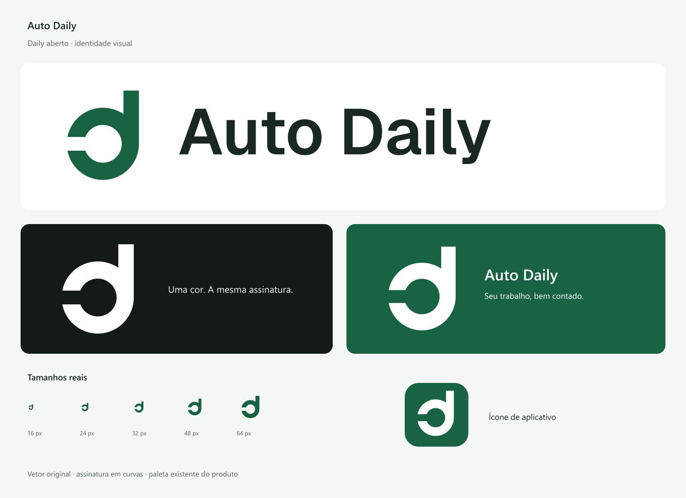

# Auto Daily: Daily aberto

A identidade substitui o ícone de documento por uma letra **d** desenhada para a marca. A abertura à esquerda é sua característica: um relato que recebe contexto e continua aberto à revisão. O símbolo identifica o projeto; não tenta ilustrar todas as integrações ou a IA.



## Kit entregue

Arquivos em `public/brand/`, prontos para usar:

No ZIP de entrega, esses assets ficam na raiz, junto a este guia; `concepts/` e `fonts/` preservam os estudos e a licença/origem tipográfica. O repositório mantém a organização `public/brand/` e `docs/brand/`.

| Uso | Arquivo |
| --- | --- |
| Assinatura principal | `horizontal-brand.svg` / `.png` |
| Fundo escuro | `horizontal-dark.svg` / `.png` |
| Uma cor | `horizontal-black.svg` e `horizontal-white.svg` |
| Assinatura vertical | `stacked-brand.svg`, `stacked-dark.svg`, `stacked-black.svg`, `stacked-white.svg` |
| Símbolo isolado | `symbol-brand.svg`, `symbol-dark.svg`, `symbol-black.svg`, `symbol-white.svg` |
| Logotipo sem símbolo | `wordmark.svg` |
| Favicon | `favicon.svg`, `favicon.ico`, `icon-16.png`, `icon-32.png`, `icon-48.png` |
| Ícone do app | `app-icon.svg`, `icon-192.png`, `icon-512.png` |
| Ícone adaptável | `maskable.svg`, `icon-maskable-512.png` |
| Apple touch | `apple-touch-icon.png`, 180 × 180 |
| Compartilhamento | `social-preview.png`, 1200 × 630, para Open Graph/Twitter |

SVGs de produção têm contornos, sem texto vivo, fontes externas, bitmaps, filtros ou máscaras. PNGs das assinaturas e do símbolo têm fundo transparente. O ícone adaptável e o Apple touch têm fundo opaco; o favicon possui composição própria para tamanhos pequenos.

## Uso e consistência

- **Paleta:** verde `#176344` (RGB 23/99/68), menta `#86D6AD` (134/214/173), grafite `#192820` (25/40/32), branco. Use a variante menta sobre o canvas escuro `#131A17`.
- **Respiro:** fora do limite do desenho, reserve pelo menos a largura da haste, aproximadamente 36 unidades no desenho de 256. Favicons e ícones de plataforma usam seus próprios recortes, não essa regra editorial.
- **Mínimos digitais:** símbolo a partir de 16 px, assinatura horizontal a partir de 140 px. Para o cabeçalho do app, símbolo de 32 px e nome em Geist SemiBold, 20 px. No mobile o símbolo passa a 28 px.
- Em peças editoriais/homepage, use a assinatura SVG completa. Em cabeçalhos operacionais, nome nativo junto ao símbolo melhora acessibilidade e integração tipográfica.
- Não estique, rotacione, adicione sombras, feche a abertura ou coloque o símbolo dentro de caixas adicionais. Use a variante apropriada ao fundo. Não reutilize o padding do ícone adaptável no favicon.
- Não altere isoladamente a curva, a haste ou a tipografia. A fonte de verdade do símbolo é `src/lib/brand.json`, usada também pelo componente React.

## Exploração e decisão

[Três estudos em preto/branco](concepts/overview.png): AD contínuo, Daily aberto e Síntese. Daily aberto teve a melhor combinação de leitura pequena, simplicidade e continuidade com a linguagem do produto. O monograma AD exigia mais atenção no encontro de hastes; Síntese se aproximava mais de sinais genéricos de integração.

Foi realizada revisão independente dos três estudos e da composição final. Não foi identificada uma leitura dominante de documento, check, brilho de IA ou refresh. A identificação por uma letra desenhada mantém o sistema simples. Essa revisão visual não equivale a uma pesquisa de anterioridade de marca; tal pesquisa não foi executada.

## Provas realizadas

- [Redução e reversão](size-proof.png), em 16/24/32/48/64/128 px, nos fundos claro e escuro.
- 17 SVGs de produção verificados sem texto/raster/filtros/dependências.
- Favicon rasterizado a 16 px: dois pixels completos de fundo na abertura, preservando o corte do desenho.
- Ícone adaptável opaco: ponto mais distante do conteúdo branco a 198,73 px do centro, dentro do círculo seguro de 204,8 px de um canvas de 512.
- ICO com frames de 16/32/48 px.
- Geometria e detalhes em [validation.json](validation.json).
- Aplicação conferida no cabeçalho real em [claro](app-header-light.jpg) e [escuro](app-header-dark.jpg), com SVG compartilhado, nome acessível e tamanho de 28 px no viewport mobile. Favicons SVG/ICO, Apple touch e ícone adaptável retornam HTTP 200 no build local.
- Check, TypeScript, build e 35 testes passaram depois da aplicação da identidade. Os testes de redução e ícones foram feitos separadamente dos testes funcionais do aplicativo.

## Tipografia e reprodução

A assinatura usa **Geist SemiBold**, obtida do [repositório oficial](https://github.com/vercel/geist-font), licenciada sob SIL OFL 1.1. O arquivo original e licença estão em `fonts/`; os contornos de “Auto Daily” foram extraídos com a coleção privada de fontes do Windows e armazenados em `fonts/wordmark-outlines.json`. Nenhuma fonte foi instalada no sistema. O símbolo é uma construção geométrica própria, independente da tipografia.

Para regenerar SVGs, PNGs, ICO e pranchas a partir dos masters:

```powershell
node scripts/build-brand-assets.mjs
```

Também disponível como `npm run brand:build`. A geração atualiza os assets e a identidade no manifest, preservando as outras opções. No Windows, o cache do renderizador de legendas fica no workspace; nenhuma fonte é instalada no sistema.

## Aplicação completa

Validada em [primeiro uso](integrated-first-use.jpg), [desktop claro](integrated-desktop-light.jpg), [desktop escuro](integrated-desktop-dark.jpg) e [mobile](integrated-mobile.jpg). Os relatórios preenchidos nessas capturas usam dados fictícios explícitos, sem consultar integrações operacionais.

- `BrandLogo` concentra símbolo e nome acessível; `BrandMark` compartilha a geometria com os exports.
- Cabeçalho, carregamento e primeiro uso usam a identidade aprovada. FileText, BookOpen e demais ícones continuam funcionais, não substitutos da marca.
- Favicons SVG/ICO, Apple touch, PNGs de instalação e recorte maskable usam os assets corretos por contexto.
- Metadata usa nome, descrição e tagline centralizados, com imagem Open Graph/Twitter de 1200 × 630. `SITE_URL` deve receber o domínio real no build de produção; não foi presumido um domínio público.
- README e guias usam os assets atuais; capturas da proposta anterior permanecem identificadas como históricas.
- 40 regressões, check, TypeScript e build passaram na integração completa. A imagem servida e as tags Open Graph/Twitter/canonical foram conferidas no build local com `SITE_URL=http://127.0.0.1:4050`. O endereço público de produção deve ser configurado na hospedagem real.

O script usa Sharp já disponível pela instalação do Next.js; não foi adicionada dependência ao aplicativo. A tipografia da interface continua sendo carregada pelo Next/font. Os assets exportados têm curvas e não precisam dessa fonte para renderizar.

## Referências de método

O arquivo `SKILL.md` fornecido pelo usuário foi consultado como referência de qualidade. Os scripts e biblioteca mencionados nele não vieram anexados; a construção e validação foram feitas com ferramentas disponíveis, sem copiar logos de terceiros.

Foram consultadas as orientações oficiais de [logos da Atlassian](https://atlassian.design/foundations/logos), incluindo separação entre símbolo, assinatura e contexto de uso, e o [guia de uso da IBM](https://www.ibm.com/design/language/files/IBM_Logo_3rdParties_300822.pdf), como referência de respiro e reprodução. As formas e proporções dessas marcas não foram reutilizadas.
